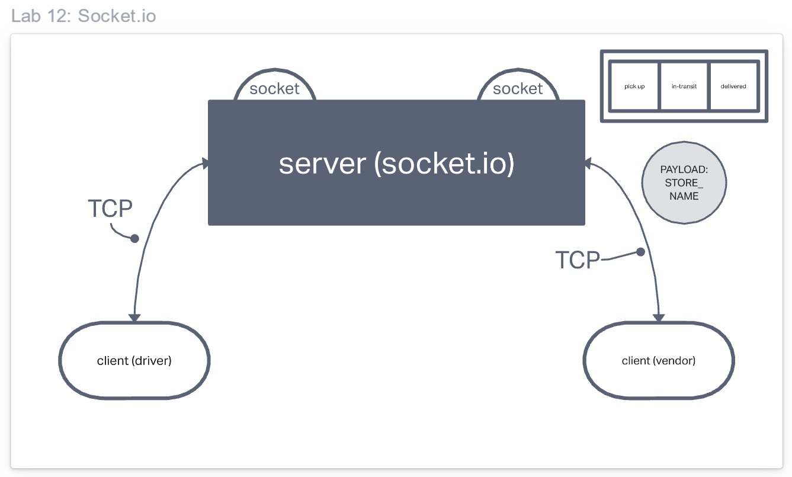

# Event Driven Applications

**CAPS** The Code Academy Parcel Service. In this sprint, build out a system that emulates a real world supply chain. **CAPS** will simulate a delivery service where vendors (such a flower shops) will ship products using our delivery service and when our drivers deliver them, each vendor will be notified that their customers received what they purchased.

This will be an event driven application that "distributes" the responsibility for logging to separate modules, using only events to trigger logging based on activity.

## User Stories

As a business, our primary goal is to increase the visibility on the state of packages in the delivery process.

We have 2 major clients for this service: Vendors and Drivers. Each need to have full and live visibility into the state of a package as it’s being delivered to a customer.

* As a vendor, I want to alert the system when I have a package to be picked up.
* As a driver, I want to be notified when there is a package to be delivered.
* As a driver, I want to alert the system when I have picked up a package and it is in transit.
* As a driver, I want to alert the system when a package has been delivered.
* As a vendor, I want to be notified when my package has been delivered.

And as developers, here are some of the development stories that are relevant to the above.

* As a developer, I want to use industry standards for managing the state of each package.
* As a developer, I want to create an event driven system so that I can write code that happens in response to events, **in real time**.

## **Phase 01**

### Technical Requirements / notes

Create the CAPS system as follows:

### Global Event Pool (HUB)

1. Implement a Module for a Global Event Pool.
   * Export a single `EventEmitter` from the [Node JS module](https://nodejs.org/api/events.html#events_class_eventemitter).
   * Should be imported by any module that needs to notify or be alerted by other modules of an event.
  
1. Implement a Module for Managing Global Package Events.
   * Listens to **ALL** events in the Event Pool.
   * Logs a timestamp and the payload of every event.

    ```json
    "EVENT": { 
      "event": "pickup",
      "time": "2020-03-06T18:27:17.732Z",
      "payload": { 
        "store": "1-206-flowers",
        "orderID": "e3669048-7313-427b-b6cc-74010ca1f8f0",
        "customer": "Jamal Braun",
        "address": "Schmittfort, LA"
      }
    }
    ```

### Vendor Client Application

1. Implement a Module for Managing Vendor Events.
   * Your implementation should use a `store name` as a parameter.
   * When triggered, the **vendor module** simulates a `pickup` event for the given `store name` to the Global Event Pool:
     * emits `pickup` to the global event pool.
     * sends a vendor order `payload`:

     ```json
      {
        "store": "<store-name>",
        "orderId": "<unique-order-id>",
        "customer": "<customer-name>",
        "address": "<city-state>"
      }
     ```

     > HINT: Have some fun by using the [Chance](https://chancejs.com/) library to make up phony information.

   * Listens for a `delivered` event and responds by logging a message to the console:

   ```javascript
    Thank you, <customer-name>
   ```

### Driver Client Application

1. Implement a Module for Managing Driver Events.
   * Listens for a `pickup` event from the Global Event Pool and responds with the following:
     * Log a message to the console: `DRIVER: picked up <ORDER_ID>`.
     * Emit an 'in-transit' event to the Global Event Pool with the order payload.
     * Log a confirmation message to the console: `DRIVER: delivered <ORDER_ID>`.
     * Emit a 'delivered` event to the Global Event Pool with the order payload.

When running, your console output should look something like this:

```javascript
EVENT { event: 'pickup',
  time: 2020-03-06T18:27:17.732Z,
  payload:
   { store: '1-206-flowers',
     orderID: 'e3669048-7313-427b-b6cc-74010ca1f8f0',
     customer: 'Jamal Braun',
     address: 'Schmittfort, LA' } }
DRIVER: picked up e3669048-7313-427b-b6cc-74010ca1f8f0
EVENT { event: 'in-transit',
  time: 2020-03-06T18:27:18.738Z,
  payload:
   { store: '1-206-flowers',
     orderID: 'e3669048-7313-427b-b6cc-74010ca1f8f0',
     customer: 'Jamal Braun',
     address: 'Schmittfort, LA' } }
DRIVER: delivered up e3669048-7313-427b-b6cc-74010ca1f8f0
VENDOR: Thank you for delivering e3669048-7313-427b-b6cc-74010ca1f8f0
EVENT { event: 'delivered',
  time: 2020-03-06T18:27:20.736Z,
  payload:
   { store: '1-206-flowers',
     orderID: 'e3669048-7313-427b-b6cc-74010ca1f8f0',
     customer: 'Jamal Braun',
     address: 'Schmittfort, LA' } }
...
```

## UML


## **Phase 2**

In this phase, we’ll be moving away from using Node Events for managing a pool of events, instead refactoring to using the Socket.io libraries. This allows communication between Server and Client applications.

The intent here is to build the data services that would drive a suite of applications where we can see pickups and deliveries in real-time.

## Phase 2 Requirements

In Phase 2, we’ll be changing the underlying networking implementation of our CAPS system from using node events to using a library called Socket.io so that clients can communicate over a network. Socket.io manages the connection pool for us, making broadcasting much easier to operate, and works well both on the terminal (between servers) and with web clients.

The core functionality we’ve already built remains the same. The difference in this phase is that we’ll be creating a networking layer. As such, the user stories that speak to application functionality remain unchanged, but our developer story changes to reflect the work needed for refactoring.

* As a vendor, I want to alert the system when I have a package to be picked up.
* As a driver, I want to be notified when there is a package to be delivered.
* As a driver, I want to alert the system when I have picked up a package and it is in transit.
* As a driver, I want to alert the system when a package has been delivered.
* As a vendor, I want to be notified when my package has been delivered.

And as developers, here is our updated story relevant to the above.

* **As a developer, I want to create network event driven system using Socket.io so that I can write code that responds to events originating from both servers and client applications**

### Phase 02: Technical Requirements / Notes

In order to switch from Node Events to Socket.io, the refactoring process will involve changes to each application to use the core features of Socket.io.

### Overview

The goal of this lab is to create a [**namespaced** Socket.io](https://socket.io/docs/v4/namespaces#Custom-namespaces) event server, and to configure **Vendor** and **Driver** Client Modules.

* The Socket Server will create a namespace of `caps` that will receive all CAPS event traffic.
* Each **Vendor** and **Driver** Client will connect to the `caps` namespace.
* The server will emit specific events to each `socket` that is listening for their designated events from the Global Event Pool defined in the Server.
* Each **Vendor** will only _emit_ and _listen_ for specific events based on their `Vendor ID`. This will be managed by [rooms](https://socket.io/docs/v3/rooms/index.html) within Socket.io.
* Each **Driver** will “pick up” a package when the vendor notifies the Server that an “order” is ready and simulate “in-transit” and “delivered” events.

The expected output of the 3 running applications is the same as it was in Phase 2.


> Note: this is the heart of refactoring. The end result **appears** to be the same even after you’ve made a holistic change on the underlying code to be cleaner and faster. As developers, we want to do great work without changing the users’ experience.

### Phase 02: Global Event Pool (HUB)

1. Use the `socket.io` npm package to configure an event Server that can be started at a designated port using node.
    * Accept connections on a namespace called `caps`, and configure `socket` objects from clients.
    * Ensure that client `sockets` are connecting to their appropriate `room` if specified.
2. Configure a Global Event Pool that every client `socket` should listen for:
    * `pickup` - this will be broadcast to all sockets.
    * `in-transit` - this will be emitted only to **Vendors** that have joined the appropriate room.
    * `delivered` - this will be be emitted only to **Vendors** that have joined the appropriate room.

        > NOTE: You may need to create an extra event here that allows clients to join “rooms”.

### Phase 02: Vendor Client Application

1. Connects to the CAPS Application Server using `socket.io-client`:
    * Make sure your module connects using the `caps` namespace.
    * Upon connection, use a `Vendor ID` to join a room, this can be a store name.
2. Upon connection, simulate a new customer order:
    * Create a payload object with your store id, order id, customer name, address.
    * Emit that message to the CAPS server with an event called `pickup`.
3. Listen for the `delivered` event coming in from the CAPS server.
    * Log “thank you for delivering `payload.id` to the console.
4. After the delivery event has been received, exit the application using `process.exit()`.

### Phase 02: Driver Client Application

1. Connects to the CAPS Application Server using `socket.io-client`:
    * Make sure this module is using the `caps` namespace to connect to the Server.
2. Once connected, the Driver client module should listen for any appropriate events from the Server:
    * When a `pickup` is emitted from the Server, _simulate_ all specified Driver behaviors.
3. Simulate the following events and emit payloads to the CAPS Application Server upon receiving a “pickup” event:
    * **`in-transit`**
        * Log “picking up `payload.id`” to the console.
        * emit an `in-transit` event to the CAPS server with the payload.
    * **`delivered`**
        * emit a `delivered` event to the CAPS server with the payload.

When running, the vendor and driver consoles should show their own logs. Additionally, the CAPS server should be logging everything.

### Notes

* You will need to start your servers up in the right order so that you can visually test things out.

1. `CAPS` - needs to be up so that it can accept and re-emit events.
2. `driver` - needs a running server to connect to ands listen for all incoming orders from the Vendor.
3. `vendor` - needs to connect to a running server so that it can hear events and emit orders.

### Visual Validation

We have deployed a web application that’s designed to test your Server. This is a good way to ensure that your system works as expected. There’s nothing to “turn in” here, this is provided for your benefit.

Open this [Web Application](https://javascript-401.netlify.app/).

It will connect to the socket.io server URL you specify (localhost or Heroku) and will subscribe to the vendor named `1-206-flowers`.

If your server, vendor and driver apps are all running according to the lab instructions and your vendor has the store name **1-206-flowers**, this application will log the payload across the supply chain in real-time. Imagine yourself at the command center, watching status updates…

## Phase 02:UML


